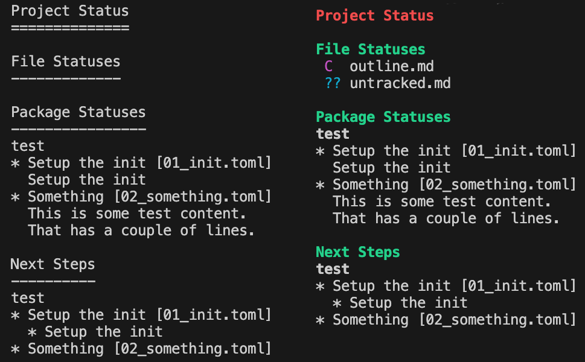

# Ability to get project status

We already have the ability to get file-history, but we want ways to get a summary of
the overall project status

## Status: P1 - medium

## Problem

## Design

### Project Status

The call is as simple as `wrought project-status`.

The output should include:
  * what files are stale, or uncommitted.
  * the status of each of the packages.
  * what the next actions the user is expected to perform are (is that part of the previous bit)


```
> wrought project-status
Files:

S  dirx/some_stale_file
 D diry/some_dirty_file
?? an_untracked_file

Packages:
test:
  02_something:
    this is some test conten
    it is not exciting
novel:
  01_just_write_it:
    To create a novel just write i

Next Steps:
test:
  Add some content to the foo.bar file.
  Then run `wrought script test/build_foo.luau`
novel:
  Just write your novel.
  Then run `wrought script novel/submit.luau`
```

Things like monitoring for changes to handle the next steps etc,
is not part of this task - but probably deserves it's own task.


For nwo we'll use a package status file that looks like:

```.toml
title = "Some stage in test"
status = """
this is some test conten
it is not exceiting
"""
nest_steps = [
  "Add some content to the foo.bar file.\nThen funr `wrought test/build_foo.luaua`"
]
```

We also support colored and uncolored output - default is uncolored.



### Directory Status

## Issue log

* [X] Create a bugtrack for automating "Next Steps" - or at least limiting it to a single call to
      `wrought update` to process all pending steps.
* [X] Get and print all file listings
* [X] Get and print all package statuses
  * [X] Determine format for package statuses.
    * For now just a file in the `.wrought/packages/packagename/status` subdirectory?
    * I'm not sure if we should use JSON, toml or just text...
    * TOML seems more readable and allows us to embed extra info later...
* [X] Get and print all package "next steps".
  * [X] determine format for next steps stuff.
    * Probably a text file somewhere
    * Nah just part of the status files.
* [X] Detecting deleted files means we cant just scan the working directory.


### Shaping

